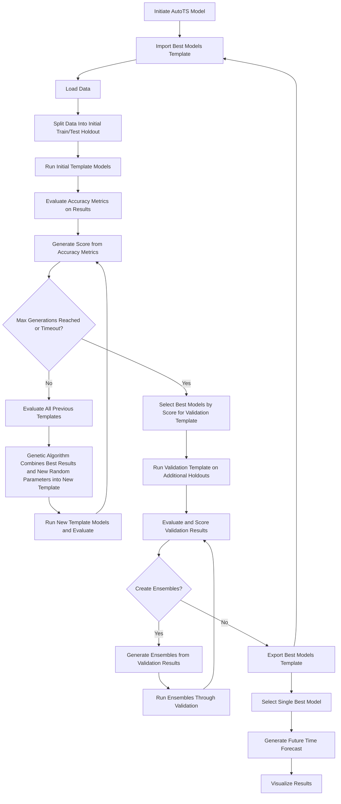

# AutoTS


AutoTS 是一个 Python 时间序列包，旨在大规模快速部署高精度预测。

2023 年，AutoTS 在 M6 预测竞赛中获胜，在 12 个月的股市预测中提供了最高绩效的投资决策。

有数十种预测模型可用于`sklearn`风格的`.fit()`和`.predict()`。
其中包括朴素、统计、机器学习和深度学习模型。
此外，在`sklearn`风格的`.fit()`、`.transform()`和`.inverse_transform()`中，还有超过 30 种特定于时间序列的变换。
所有这些功能都直接在 Pandas Dataframes 上运行，无需转换为专有对象。

所有模型都支持预测多元（多个时间序列）输出，并且还支持概率（上限/下限）预测。
大多数模型可以轻松扩展到数万甚至数十万个输入系列。
许多模型还支持传入用户定义的外生回归量。

这些模型均设计用于集成到 AutoML 特征搜索中，该搜索可通过遗传算法自动查找给定数据集的最佳模型、预处理和集成。

水平(Horizontal)和马赛克风格(mosaic style)的组合是旗舰组合类型，允许每个系列接收最准确的模型，同时仍然保持可扩展性。

指标和交叉验证选项的组合、应用子集和加权的能力、回归器生成工具、模拟预测模式、事件风险预测、实时数据集、模板导入和导出、绘图以及数据整形参数的集合使 可用的功能集。

## 目录
* [安装](https://github.com/winedarksea/AutoTS#installation)
* [基本使用](https://github.com/winedarksea/AutoTS#basic-use)
* [速度和大数据提示](https://github.com/winedarksea/AutoTS#tips-for-speed-and-large-data)
* 扩展教程 [GitHub](https://github.com/winedarksea/AutoTS/blob/master/extended_tutorial.md) or [Docs](https://winedarksea.github.io/AutoTS/build/html/source/tutorial.html)
* [生产示例](https://github.com/winedarksea/AutoTS/blob/master/production_example.py)

## 安装
```
pip install autots
```
这包括基本模型的依赖项，但某些模型和方法需要[附加包](https://github.com/winedarksea/AutoTS/blob/master/extended_tutorial.md#installation-and-dependency-versioning) 

请注意，还有其他几个项目选择了类似的名称，因此请确保您使用的是正确的 AutoTS 代码、论文和文档。.

##  基本使用

AutoTS 的输入数据预计采用 *长* 或 *宽* 格式：  （*long* or *wide* ）
- *wide* 格式是一个带有`pandas.DatetimeIndex`的`pandas.DataFrame`，每列都是一个不同的series。
- *long* 格式包含三列：
  - Date（最好已经是 pandas 识别的` 日期时间` 格式）。
  - Series ID. 对于单个时间序列，series_id 可以 `= None`。 
  - Value
- 对于 *long* 数据，每个数据的列名称都会作为`date_col`、`id_col`和`value_col`传递给``.fit()`。 *wide* 数据不需要参数。

Lower-level 的函数仅针对 `wide`类型数据而设计。

```python
# 其他载入选项: _hourly, _monthly, _weekly, _yearly, or _live_daily
from autots import AutoTS, load_daily

# 示例数据集可用于*长*导入形状或*宽*导入形状
long = False
df = load_daily(long=long)

model = AutoTS(
    forecast_length=21,
    frequency="infer",
    prediction_interval=0.9,
    ensemble=None,
    model_list="superfast",  # "fast", "default", "fast_parallel"
    transformer_list="fast",  # "superfast",
    drop_most_recent=1,
    max_generations=4,
    num_validations=2,
    validation_method="backwards"
)
model = model.fit(
    df,
    date_col='datetime' if long else None,
    value_col='value' if long else None,
    id_col='series_id' if long else None,
)

prediction = model.predict()
# 绘制一个样本
prediction.plot(model.df_wide_numeric,
                series=model.df_wide_numeric.columns[0],
                start_date="2019-01-01")
# 打印最佳模型的详细信息
print(model)

# 点预测 dataframe
forecasts_df = prediction.forecast
# 预测上限和下限
forecasts_up, forecasts_low = prediction.upper_forecast, prediction.lower_forecast

# 所有尝试的模型结果的准确性
model_results = model.results()
# 并从交叉验证中汇总
validation_results = model.results("validation")
```

The lower-level API, in particular the large section of time series transformers in the scikit-learn style, can also be utilized independently from the AutoML framework.

Check out [extended_tutorial.md](https://winedarksea.github.io/AutoTS/build/html/source/tutorial.html) for a more detailed guide to features.

Also take a look at the [production_example.py](https://github.com/winedarksea/AutoTS/blob/master/production_example.py)

## Tips for Speed and Large Data:
* Use appropriate model lists, especially the predefined lists:
	* `superfast` (simple naive models) and `fast` (more complex but still faster models, optimized for many series)
	* `fast_parallel` (a combination of `fast` and `parallel`) or `parallel`, given many CPU cores are available
		* `n_jobs` usually gets pretty close with `='auto'` but adjust as necessary for the environment
	* 'scalable' is the best list to avoid crashing when many series are present. There is also a transformer_list = 'scalable'
	* see a dict of predefined lists (some defined for internal use) with `from autots.models.model_list import model_lists`
* Use the `subset` parameter when there are many similar series, `subset=100` will often generalize well for tens of thousands of similar series.
	* if using `subset`, passing `weights` for series will weight subset selection towards higher priority series.
	* if limited by RAM, it can be distributed by running multiple instances of AutoTS on different batches of data, having first imported a template pretrained as a starting point for all.
* Set `model_interrupt=True` which passes over the current model when a `KeyboardInterrupt` ie `crtl+c` is pressed (although if the interrupt falls between generations it will stop the entire training).
* Use the `result_file` method of `.fit()` which will save progress after each generation - helpful to save progress if a long training is being done. Use `import_results` to recover.
* While Transformations are pretty fast, setting `transformer_max_depth` to a lower number (say, 2) will increase speed. Also utilize `transformer_list` == 'fast' or 'superfast'.
* Check out [this example](https://github.com/winedarksea/AutoTS/discussions/76) of using AutoTS with pandas UDF.
* Ensembles are obviously slower to predict because they run many models, 'distance' models 2x slower, and 'simple' models 3x-5x slower.
	* `ensemble='horizontal-max'` with `model_list='no_shared_fast'` can scale relatively well given many cpu cores because each model is only run on the series it is needed for.
* Reducing `num_validations` and `models_to_validate` will decrease runtime but may lead to poorer model selections.
* For datasets with many records, upsampling (for example, from daily to monthly frequency forecasts) can reduce training time if appropriate.
	* this can be done by adjusting `frequency` and `aggfunc` but is probably best done before passing data into AutoTS.
* It will be faster if NaN's are already filled. If a search for optimal NaN fill method is not required, then fill any NaN with a satisfactory method before passing to class.
* Set `runtime_weighting` in `metric_weighting` to a higher value. This will guide the search towards faster models, although it may come at the expense of accuracy. 
* Memory shortage is the most common cause of random process/kernel crashes. Try testing a data subset and using a different model list if issues occur. Please also report crashes if found to be linked to a specific set of model parameters (not AutoTS parameters but the underlying forecasting model params). Also crashes vary significantly by setup such as underlying linpack/blas so seeing crash differences between environments can be expected. 

## How to Contribute:
* Give feedback on where you find the documentation confusing
* Use AutoTS and...
	* Report errors and request features by adding Issues on GitHub
	* Posting the top model templates for your data (to help improve the starting templates)
	* Feel free to recommend different search grid parameters for your favorite models
* And, of course, contributing to the codebase directly on GitHub.


## AutoTS Process


*Also known as Project CATS (Catlin's Automated Time Series) hence the logo.*
